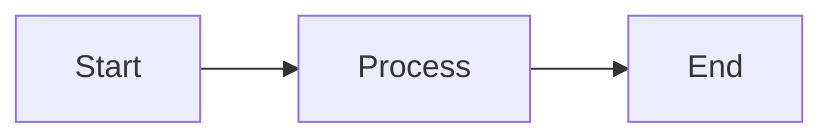

## Short Code Block

```js
const x = 1;
```

## Long Code Block

```js
// This is a deliberately long line that should overflow the code block container and trigger the word wrap toggle button to appear for testing purposes
const longVariable = "this string is intentionally very long to test horizontal scrolling and word wrap functionality in code blocks";
```

## Tabs Component

<Tabs>
  <TabItem label="JavaScript" value="js">
    ```js
    console.log("Hello from JS");
    ```
  </TabItem>
  <TabItem label="Python" value="py">
    ```python
    print("Hello from Python")
    ```
  </TabItem>
  <TabItem label="Rust" value="rust">
    ```rust
    fn main() {
        println!("Hello from Rust");
    }
    ```
  </TabItem>
</Tabs>

## Details Component

<Details title="Click to expand">
  This is hidden content inside a details block.
</Details>

## Mermaid Diagram


