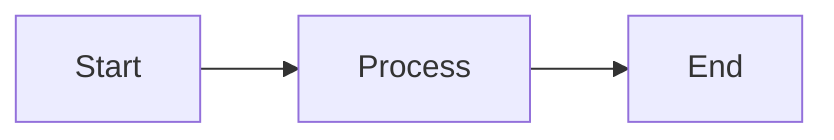

## Short Code Block

```js
const x = 1;
```

## Long Code Block

```js
// This is a deliberately long line that should overflow the code block container and trigger the word wrap toggle button to appear for testing purposes
const longVariable = "this string is intentionally very long to test horizontal scrolling and word wrap functionality in code blocks";
```

## Enriched Legacy Code Block

```js title="legacy-compat-title.js"
const unchanged = 1;
const removed = 2; // [!code --]
const added = 3; // [!code ++]
```

```js {2}
const normalLine = true;
const highlightedLine = true;
```

## Future Class-Mode Compatibility Fixture

{/*
  Representative DOM only: issue #2741 activates class mode after this
  compatibility wave. Keeping the fixture authored as JSX lets this wave
  verify consumers without changing the smoke fixture's renderer config. Keep
  the nested JSX on one line so the current emitter does not insert paragraph
  nodes inside pre/code.
*/}

<div className="code-block-container" data-code-compat-fixture="class-container"><div className="code-block-title">class-mode-compat.ts</div><pre className="hi-root" data-code-compat-fixture="class"><code><span className="line" data-line-highlight="true"><span className="hi-keyword">const</span> <span className="highlighted-word">futureValue</span> = 1;</span>{"\n"}<span className="line" data-line-diff="removed">const previousValue = 0;</span>{"\n"}<span className="line" data-line-diff="added">const nextValue = 2;</span></code></pre></div>

## Unrelated Plain Pre Fixture

<div data-code-compat-fixture="plain-container"><pre data-code-compat-fixture="plain"><code>plain code must stay unenhanced</code></pre></div>

## Tabs Component

<Tabs>

  <TabItem label="JavaScript" value="js">
    ```js
    console.log("Hello from JS");
    ```
  </TabItem>
  <TabItem label="Python" value="py">
    ```python
    print("Hello from Python")
    ```
  </TabItem>
  <TabItem label="Rust" value="rust">
    ```rust
    fn main() {
        println!("Hello from Rust");
    }
    ```
  </TabItem>

</Tabs>

## Details Component

<Details title="Click to expand">

  This is hidden content inside a details block.

</Details>

## Mermaid Diagram


```mermaid
graph LR
    A[Start] --> B[Process]
    B --> C[End]
```
