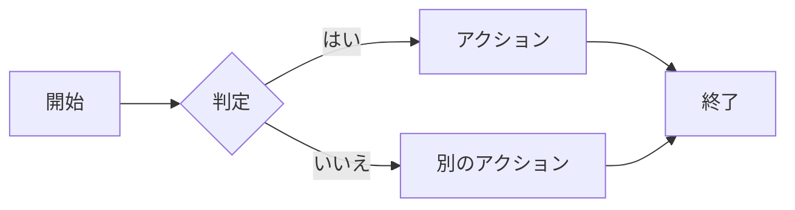
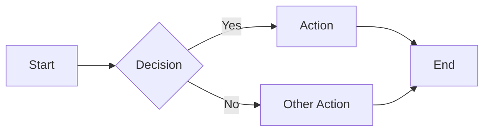
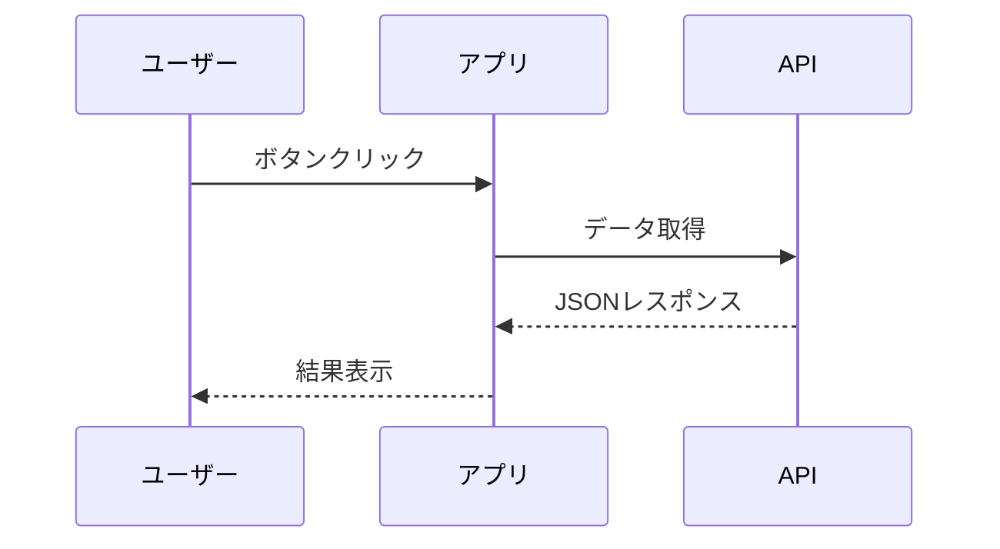
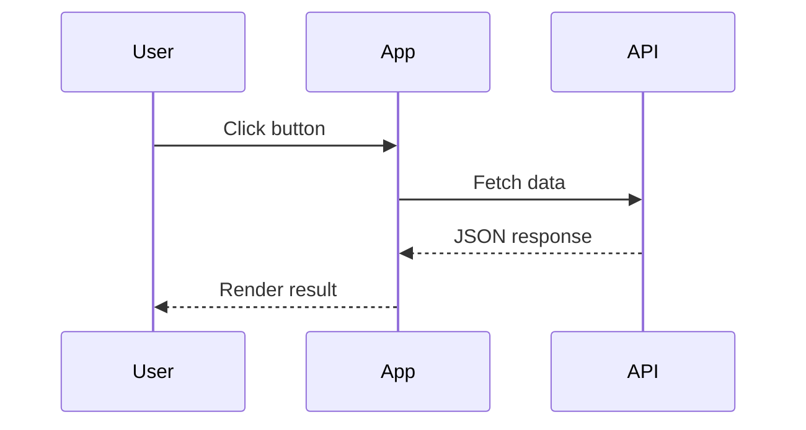
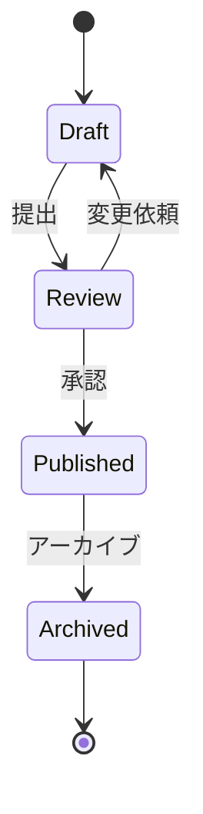
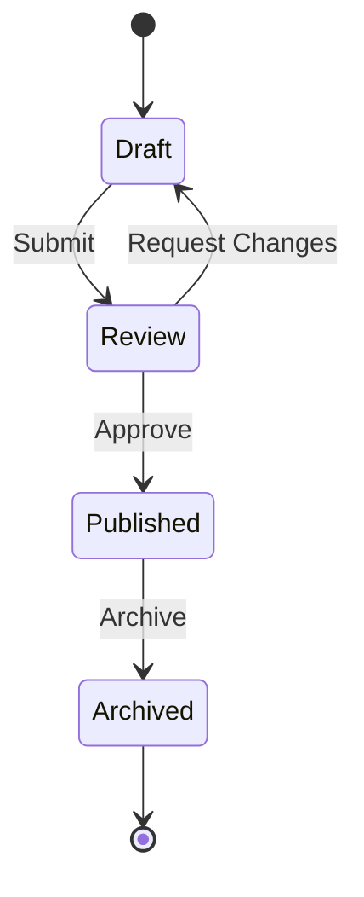

`mermaid`言語のフェンスドコードブロックでダイアグラムを描画できます。Mermaidはオンデマンドで読み込まれるため、Mermaidブロックのないページにはオーバーヘッドがありません。

## フローチャート



````mdx

````

## シーケンス図



````mdx

````

## 状態遷移図



````mdx

````

## 設定

Mermaidサポートは`src/config/settings.ts`の`mermaid`設定で制御されます：

```ts
export const settings = {
  // ...
  mermaid: true, // デフォルトで有効
};
```

サポートされているダイアグラムの種類については、[Mermaid公式ドキュメント](https://mermaid.js.org/)を参照してください。
