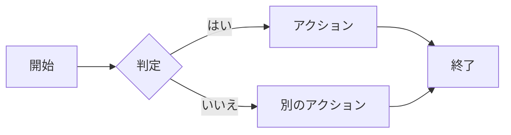
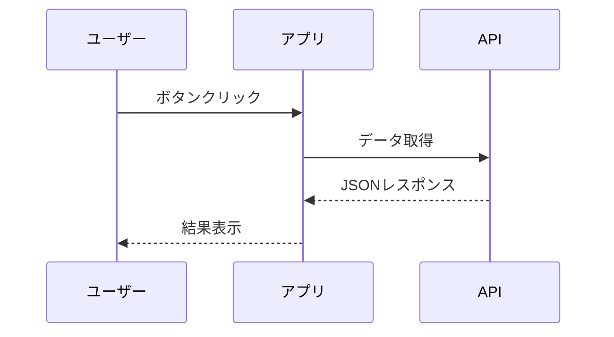
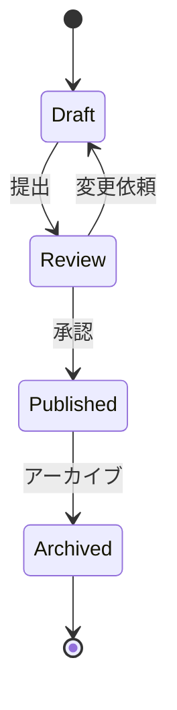
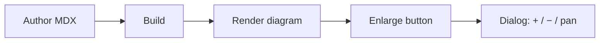

`mermaid`言語のフェンスドコードブロックでダイアグラムを描画できます。Mermaidはオンデマンドで読み込まれるため、Mermaidブロックのないページにはオーバーヘッドがありません。

## フローチャート


```mermaid
graph LR
  A[開始] --> B{判定}
  B -->|はい| C[アクション]
  B -->|いいえ| D[別のアクション]
  C --> E[終了]
  D --> E
```

````mdx

```mermaid

graph LR
  A[開始] --> B{判定}
  B -->|はい| C[アクション]
  B -->|いいえ| D[別のアクション]
  C --> E[終了]
  D --> E

```
````

## シーケンス図


```mermaid
sequenceDiagram
  participant ユーザー
  participant アプリ
  participant API
  ユーザー->>アプリ: ボタンクリック
  アプリ->>API: データ取得
  API-->>アプリ: JSONレスポンス
  アプリ-->>ユーザー: 結果表示
```

````mdx

```mermaid

sequenceDiagram
  participant ユーザー
  participant アプリ
  participant API
  ユーザー->>アプリ: ボタンクリック
  アプリ->>API: データ取得
  API-->>アプリ: JSONレスポンス
  アプリ-->>ユーザー: 結果表示

```
````

## 状態遷移図


```mermaid
stateDiagram-v2
  [*] --> Draft
  Draft --> Review : 提出
  Review --> Published : 承認
  Review --> Draft : 変更依頼
  Published --> Archived : アーカイブ
  Archived --> [*]
```

````mdx

```mermaid

stateDiagram-v2
  [*] --> Draft
  Draft --> Review : 提出
  Review --> Published : 承認
  Review --> Draft : 変更依頼
  Published --> Archived : アーカイブ
  Archived --> [*]

```
````

## 拡大とズーム・パン

描画されたすべての図には、その右上に**拡大**ボタンが表示されます。これは [Image Enlarge](../markdown-features/image-enlarge.mdx) と同じ操作感です。クリックすると、Google マップのようなズーム・パン操作ができるダイアログで図が開き、情報量の多い図も近くで確認できます。

ダイアログには 3 つのコントロールがあります。

- **`+`** で拡大します。
- **`−`** で縮小しますが、ダイアログの元の全幅サイズより小さくはなりません。
- **パン（手のアイコン）** で、拡大した図をドラッグして移動できます。

有効・無効の挙動は次のとおりです。

- 開いた直後は、図が全サイズで表示されます。`−` と**パン**は**無効**で、クリックできるのは `+` のみです。
- `+` をクリックすると拡大され、`−` と**パン**が**有効**になります。
- **パン**が有効な状態では、ドラッグして図をパンできます。
- `−` をクリックすると縮小し、元の全幅に戻ると `−` と**パン**は再び**無効**になります。

下の図で試してみてください。拡大ボタンをクリックし、`+` でズーム、手のアイコンでパンできます。


```mermaid
flowchart LR
  A[Author MDX] --> B[Build]
  B --> C[Render diagram]
  C --> D[Enlarge button]
  D --> E[Dialog: + / − / pan]
```

## 設定

Mermaidサポートは`src/config/settings.ts`の`mermaid`設定で制御されます：

```ts
export const settings = {
  // ...
  mermaid: true, // デフォルトで有効
};
```

サポートされているダイアグラムの種類については、[Mermaid公式ドキュメント](https://mermaid.js.org/)を参照してください。
