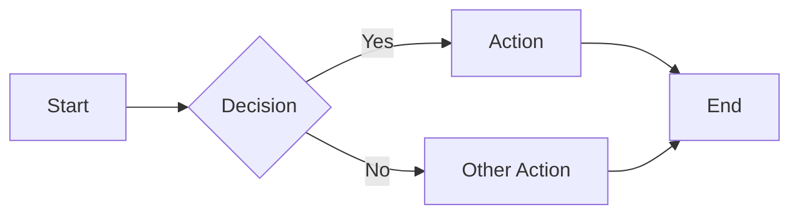
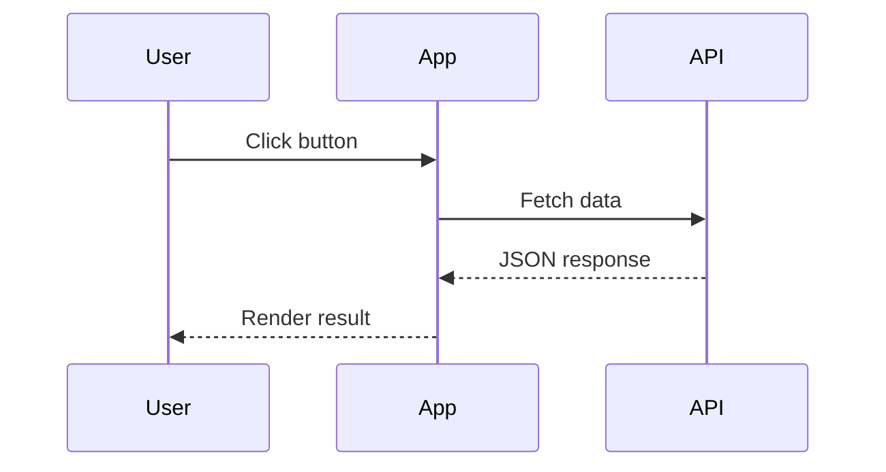

**Mermaid** 機能は、`mermaid` 言語を指定したフェンスコードブロックを描画済みの図に変換します。ビルド時にコードブロックがラッパー要素に置き換えられ、小さなクライアントサイドアイランドが必要に応じて Mermaid ライブラリを読み込んで図を描画します。mermaid ブロックを含まないページにはオーバーヘッドがありません。

:::note Opt-in 機能

`zfb.config.ts` の `mermaid` キーで有効化します。

```ts
// zfb.config.ts
export default defineConfig({
  markdown: {
    features: {
      mermaid: true,
    },
  },
});
```

:::

## 構文

言語識別子として `mermaid` を指定したフェンスコードブロックを書きます。

````md

````

## ライブデモ

以下のブロックは、このページ上でフローチャートとして描画されます。


シーケンス図も同じ要領です。



## 仕組み

ビルド時に、Markdown パイプラインは `<pre><code class="language-mermaid">` ブロックを `<div class="mermaid">` ラッパーに置き換え、図のソースをエスケープせずに残すため、レンダラーは生の Mermaid DSL を受け取ります。mermaid パスは構文ハイライトより前に実行されるため、syntect は図のソースに触れません。実行時にはクライアントアイランドがラッパーを検出して図を描画します。

サポートされるすべての図の種類（フローチャート、シーケンス、ステート、クラス、ガントなど）については [Mermaid のドキュメント](https://mermaid.js.org/) を参照してください。
