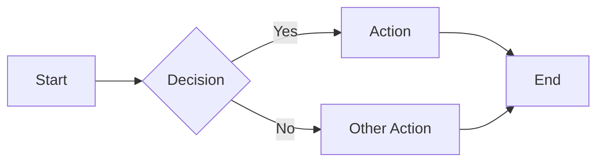
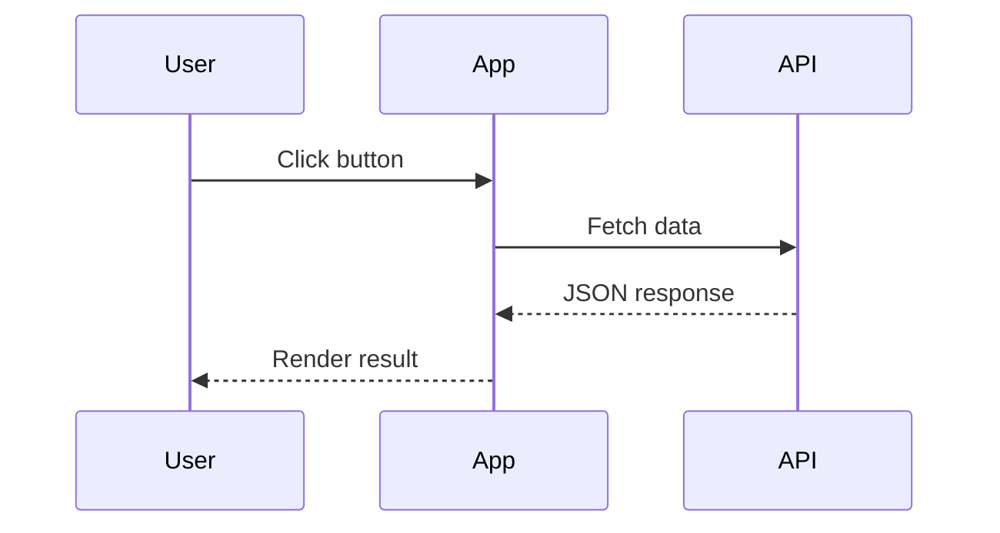
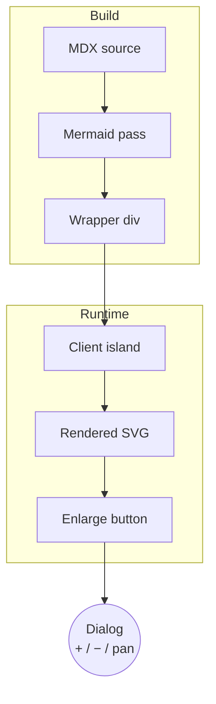

**Mermaid** 機能は、`mermaid` 言語を指定したフェンスコードブロックを描画済みの図に変換します。ビルド時にコードブロックがラッパー要素に置き換えられ、小さなクライアントサイドアイランドが必要に応じて Mermaid ライブラリを読み込んで図を描画します。mermaid ブロックを含まないページにはオーバーヘッドがありません。

:::note Opt-in 機能

`zfb.config.ts` の `mermaid` キーで有効化します。

```ts
// zfb.config.ts
export default defineConfig({
  markdown: {
    features: {
      mermaid: true,
    },
  },
});
```

:::

## 構文

言語識別子として `mermaid` を指定したフェンスコードブロックを書きます。

````md

````

## ライブデモ

以下のブロックは、このページ上でフローチャートとして描画されます。


シーケンス図も同じ要領です。



## 拡大とズーム・パン

描画されたすべての図には、その右上に**拡大**ボタンが表示されます。これは [Image Enlarge](./image-enlarge.mdx) と同じ操作感です。クリックすると、Google マップのような操作ができるダイアログで図が開き、情報量の多い図もじっくり確認できます。

ダイアログには次の 3 つのコントロールがあります。

- **ズームイン（`+`）** — 図を拡大します。
- **ズームアウト（`−`）** — 図を縮小しますが、ダイアログの全幅より小さくはなりません。
- **パン（手のアイコン）** — 有効にすると、図をドラッグしてダイアログ内で移動できます。

コントロールの有効・無効は次のロジックに従います。

- 開いた直後は、図がダイアログいっぱいの全サイズで表示されます。クリックできるのは `+` のみで、`−` と**パン**は**無効**です（開始サイズより小さくはできず、まだパンする余地もないためです）。
- `+` をクリックすると拡大され、`−` と**パン**の両方が**有効**になります。
- **パン**が有効な状態では、ドラッグして図をビューポート内で動かせます。
- `−` をクリックすると再び縮小します。図が元の全幅サイズに戻ると、`−` と**パン**は再び**無効**になります。

下のフローチャートで試してみてください。右上の拡大ボタンをクリックし、`+` でズーム、手のアイコンでパンできます。



## 仕組み

ビルド時に、Markdown パイプラインは `<pre><code class="language-mermaid">` ブロックを `<div class="mermaid">` ラッパーに置き換え、図のソースをエスケープせずに残すため、レンダラーは生の Mermaid DSL を受け取ります。mermaid パスは構文ハイライトより前に実行されるため、コードハイライターは図のソースに触れません。実行時にはクライアントアイランドがラッパーを検出して図を描画します。

サポートされるすべての図の種類（フローチャート、シーケンス、ステート、クラス、ガントなど）については [Mermaid のドキュメント](https://mermaid.js.org/) を参照してください。

## 関連ページ

- [Mermaid ダイアグラム コンポーネント](../components/mermaid-diagrams.mdx) — 拡大・ズーム/パンダイアログのビジュアル・操作面のショーケース
