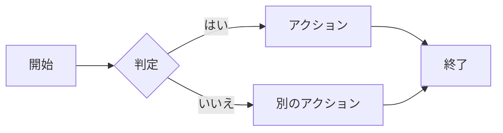
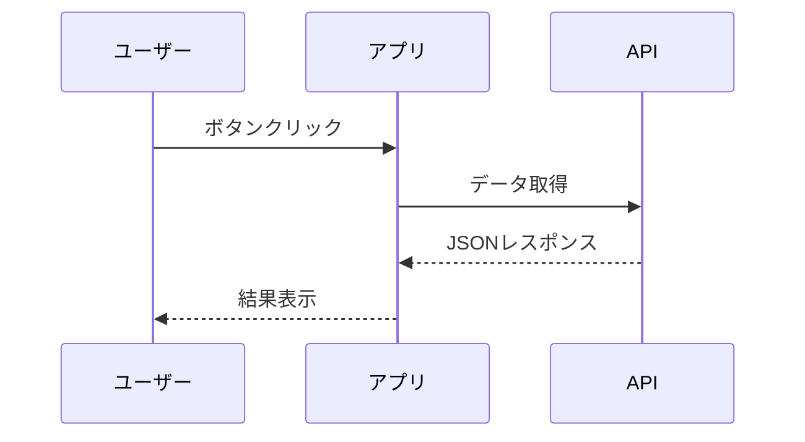
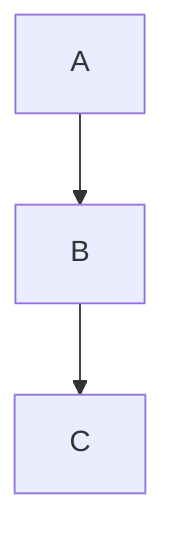

ここに記載されているコンポーネントはすべてMDXファイル内でグローバルに利用できます。インポートは不要です。

## アドモニション

アドモニションは重要な情報を強調するためのコールアウトブロックです。各タイプは異なる色を持ち、`title` プロップでデフォルトのタイトルを上書きできます。

### Note

<Note>
これはNoteアドモニションです。一般的な情報の表示に使用します。
</Note>

<Note title="カスタムタイトル">
`title` プロップでタイトルをカスタマイズできます。
</Note>

### Tip

<Tip>
これはTipです。便利なヒントやベストプラクティスの紹介に使用します。
</Tip>

<Tip title="便利なヒント">
カスタムタイトル付きのTipです。
</Tip>

### Info

<Info>
これはInfoブロックです。追加の背景情報やコンテキストの提供に使用します。
</Info>

<Info title="豆知識">
カスタムタイトル付きのInfoブロックです。
</Info>

### Warning

<Warning>
これはWarningです。潜在的な問題や注意点のフラグに使用します。
</Warning>

<Warning title="非推奨のお知らせ">
カスタムタイトル付きのWarningです。
</Warning>

### Danger

<Danger>
これはDangerアラートです。データ損失や破壊的変更に関する重大な警告に使用します。
</Danger>

<Danger title="破壊的変更">
カスタムタイトル付きのDangerアラートです。
</Danger>

### アドモニションの構文

```mdx
<Note>
デフォルトタイトルのNote。
</Note>

<Warning title="注意">
カスタムタイトル付きのWarning。
</Warning>
```

### カラーリファレンス

| タイプ  | パレットスロット | 代表的な色 |
| ------- | ---------------- | ---------- |
| Note    | p4               | 青         |
| Tip     | p2               | 緑         |
| Info    | p6               | シアン     |
| Warning | p3               | 黄         |
| Danger  | p1               | 赤         |

## タブ

`<Tabs>` と `<TabItem>` を使ってタブ付きコンテンツパネルを作成できます。複数言語でのコード表示やプラットフォーム別の手順表示に便利です。

<Tabs>
  <TabItem label="npm" value="npm" default>
    ```bash
    npm install zudo-doc
    ```
  </TabItem>
  <TabItem label="pnpm" value="pnpm">
    ```bash
    pnpm add zudo-doc
    ```
  </TabItem>
  <TabItem label="yarn" value="yarn">
    ```bash
    yarn add zudo-doc
    ```
  </TabItem>
</Tabs>

### 構文

```mdx
<Tabs>
  <TabItem label="npm" value="npm" default>
    npmタブのコンテンツ。
  </TabItem>
  <TabItem label="pnpm" value="pnpm">
    pnpmタブのコンテンツ。
  </TabItem>
</Tabs>
```

### プロップ

**Tabs:**

| プロップ | 型 | 説明 |
|------|------|-------------|
| `groupId` | string | 同じ `groupId` を持つ複数の `<Tabs>` 間でタブ選択を同期（localStorageに保存） |

**TabItem:**

| プロップ | 型 | 説明 |
|------|------|-------------|
| `label` | string | タブボタンのテキスト（必須） |
| `value` | string | 一意の値識別子（デフォルトは `label`） |
| `default` | boolean | このタブを初期アクティブに設定 |

### タブの同期

`groupId` を使って、同一ページ内の複数タブグループの選択を同期できます：

```mdx
<Tabs groupId="package-manager">
  <TabItem label="npm" default>npm install</TabItem>
  <TabItem label="pnpm">pnpm add</TabItem>
</Tabs>

<!-- 上のグループと同期 -->
<Tabs groupId="package-manager">
  <TabItem label="npm" default>npm run build</TabItem>
  <TabItem label="pnpm">pnpm build</TabItem>
</Tabs>
```

## 折りたたみ（Details）

`<Details>` で折りたたみ可能なコンテンツセクションを作成できます：

<Details title="クリックして展開">
このコンテンツはデフォルトで非表示になっており、ユーザーがサマリーをクリックすると表示されます。

コードブロックや他のコンポーネントを含む任意のMDXコンテンツを内部に含めることができます。
</Details>

### 構文

```mdx
<Details title="任意のタイトル">
非表示のコンテンツ。
</Details>
```

| プロップ | 型 | デフォルト | 説明 |
|------|------|---------|-------------|
| `title` | string | `"Details"` | クリック可能なサマリーテキスト |

## 数式

設定で `math` が有効な場合（デフォルト: `true`）、KaTeXを使って数式をレンダリングできます。

### インライン数式

ドル記号1つでインライン数式を表示：`$E = mc^2$` は $E = mc^2$ と表示されます。

### ブロック数式

ドル記号2つでディスプレイ数式を表示：

$$
\int_{-\infty}^{\infty} e^{-x^2} dx = \sqrt{\pi}
$$

### 構文

```mdx
インライン: $E = mc^2$

ブロック:
$$
\sum_{i=1}^{n} i = \frac{n(n+1)}{2}
$$
```

`math` 言語のフェンスドコードブロックも使用できます：

````mdx
```math
\nabla \times \mathbf{E} = -\frac{\partial \mathbf{B}}{\partial t}
```
````

## Mermaidダイアグラム

`mermaid`言語のフェンスドコードブロックでダイアグラムを描画できます。Mermaidはオンデマンドで読み込まれるため、Mermaidブロックのないページにはオーバーヘッドがありません。

### フローチャート



### シーケンス図



### 構文

````mdx

````

サポートされているダイアグラムの種類については、[Mermaid公式ドキュメント](https://mermaid.js.org/)を参照してください。

## タイポグラフィ

以下の標準的なMarkdown/MDX要素は、デザイントークンシステムによってスタイリングされています。

### 見出し

`h2` から `h4` までの見出しは、右サイドバーの目次に表示されます。

### テキストの書式

これは通常の段落です。**太字テキスト**、_イタリックテキスト_、~~取り消し線テキスト~~を使用できます。**_太字とイタリック_**を組み合わせることもできます。

### インラインコード

バッククォートでインラインコードを表示できます：`const x = 42` や `pnpm dev`。

### コードブロック

フェンスドコードブロックはShikiによるシンタックスハイライトに対応しています。アクティブなカラースキームのテーマが適用されます。

```ts
function greet(name: string): string {
  return `Hello, ${name}!`;
}
```

```css
.container {
  display: flex;
  gap: 1rem;
  align-items: center;
}
```

```mdx
---
title: サンプルページ
sidebar_position: 1
---

**Markdown**に対応したコンテンツを記述できます。
```

### 箇条書きリスト

- 1つ目の項目
- 2つ目の項目
  - ネストされた項目A
  - ネストされた項目B
- 3つ目の項目

### 番号付きリスト

1. ステップ1
2. ステップ2
   1. サブステップA
   2. サブステップB
3. ステップ3

### 引用

> これは引用ブロックです。**書式付きテキスト**や複数段落を含めることができます。
>
> 同じ引用ブロック内の2番目の段落。

### テーブル

| 機能             | 状態   | 備考                           |
| ---------------- | ------ | ------------------------------ |
| MDXサポート      | 有効   | デフォルトで有効               |
| アドモニション   | 有効   | 5種類利用可能                  |
| コードハイライト | 有効   | Shikiによるテーマ対応          |
| i18n             | 有効   | 英語と日本語                   |

### リンク

- 内部リンク：[ドキュメントの書き方](/ja/docs/getting-started/writing-docs)
- 内部リンク：[はじめに](/ja/docs/getting-started/introduction)

### 水平線

水平線の上のコンテンツ。

---

水平線の下のコンテンツ。
