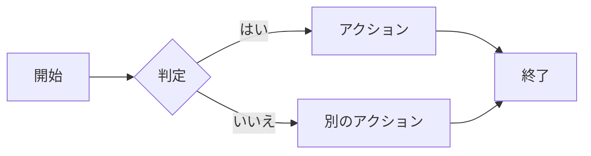
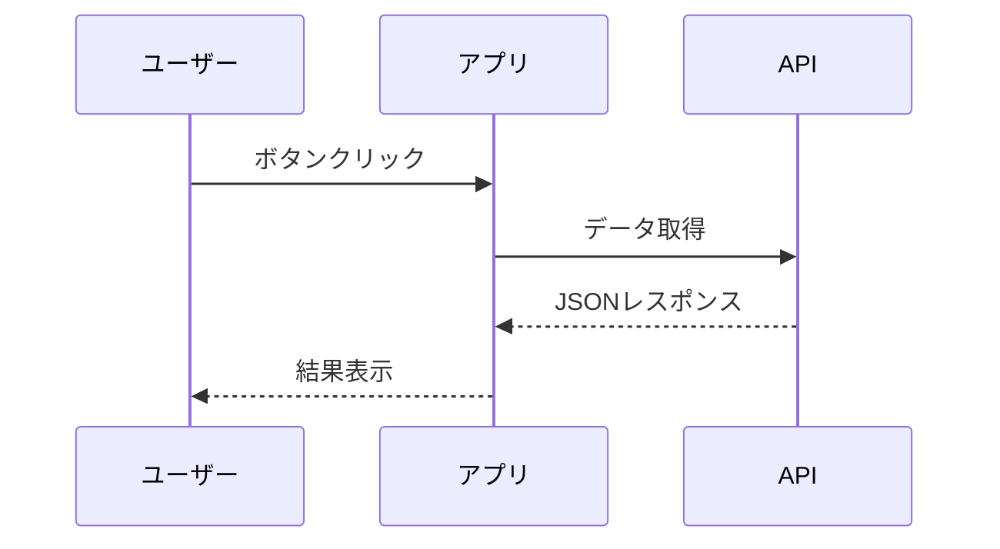
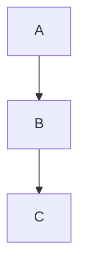

ここに記載されているコンポーネントはすべてMDXファイル内でグローバルに利用できます。インポートは不要です。

## アドモニション

アドモニションは重要な情報を強調するためのコールアウトブロックです。各タイプは異なる色を持ち、`title` プロップでデフォルトのタイトルを上書きできます。

### Note

<Note>
これはNoteアドモニションです。一般的な情報の表示に使用します。
</Note>

<Note title="カスタムタイトル">
`title` プロップでタイトルをカスタマイズできます。
</Note>

### Tip

<Tip>
これはTipです。便利なヒントやベストプラクティスの紹介に使用します。
</Tip>

<Tip title="便利なヒント">
カスタムタイトル付きのTipです。
</Tip>

### Info

<Info>
これはInfoブロックです。追加の背景情報やコンテキストの提供に使用します。
</Info>

<Info title="豆知識">
カスタムタイトル付きのInfoブロックです。
</Info>

### Warning

<Warning>
これはWarningです。潜在的な問題や注意点のフラグに使用します。
</Warning>

<Warning title="非推奨のお知らせ">
カスタムタイトル付きのWarningです。
</Warning>

### Danger

<Danger>
これはDangerアラートです。データ損失や破壊的変更に関する重大な警告に使用します。
</Danger>

<Danger title="破壊的変更">
カスタムタイトル付きのDangerアラートです。
</Danger>

### アドモニションの構文

```mdx
<Note>
デフォルトタイトルのNote。
</Note>

<Warning title="注意">
カスタムタイトル付きのWarning。
</Warning>
```

### カラーリファレンス

| タイプ  | パレットスロット | 代表的な色 |
| ------- | ---------------- | ---------- |
| Note    | p4               | 青         |
| Tip     | p2               | 緑         |
| Info    | p6               | シアン     |
| Warning | p3               | 黄         |
| Danger  | p1               | 赤         |

## Mermaidダイアグラム

`mermaid`言語のフェンスドコードブロックでダイアグラムを描画できます。Mermaidはオンデマンドで読み込まれるため、Mermaidブロックのないページにはオーバーヘッドがありません。

### フローチャート



### シーケンス図



### 構文

````mdx

````

サポートされているダイアグラムの種類については、[Mermaid公式ドキュメント](https://mermaid.js.org/)を参照してください。

## タイポグラフィ

以下の標準的なMarkdown/MDX要素は、デザイントークンシステムによってスタイリングされています。

### 見出し

`h2` から `h4` までの見出しは、右サイドバーの目次に表示されます。

### テキストの書式

これは通常の段落です。**太字テキスト**、_イタリックテキスト_、~~取り消し線テキスト~~を使用できます。**_太字とイタリック_**を組み合わせることもできます。

### インラインコード

バッククォートでインラインコードを表示できます：`const x = 42` や `pnpm dev`。

### コードブロック

フェンスドコードブロックはShikiによるシンタックスハイライトに対応しています。アクティブなカラースキームのテーマが適用されます。

```ts
function greet(name: string): string {
  return `Hello, ${name}!`;
}
```

```css
.container {
  display: flex;
  gap: 1rem;
  align-items: center;
}
```

```mdx
---
title: サンプルページ
sidebar_position: 1
---

**Markdown**に対応したコンテンツを記述できます。
```

### 箇条書きリスト

- 1つ目の項目
- 2つ目の項目
  - ネストされた項目A
  - ネストされた項目B
- 3つ目の項目

### 番号付きリスト

1. ステップ1
2. ステップ2
   1. サブステップA
   2. サブステップB
3. ステップ3

### 引用

> これは引用ブロックです。**書式付きテキスト**や複数段落を含めることができます。
>
> 同じ引用ブロック内の2番目の段落。

### テーブル

| 機能             | 状態   | 備考                           |
| ---------------- | ------ | ------------------------------ |
| MDXサポート      | 有効   | デフォルトで有効               |
| アドモニション   | 有効   | 5種類利用可能                  |
| コードハイライト | 有効   | Shikiによるテーマ対応          |
| i18n             | 有効   | 英語と日本語                   |

### リンク

- 内部リンク：[ドキュメントの書き方](/ja/docs/getting-started/writing-docs)
- 内部リンク：[はじめに](/ja/docs/getting-started/introduction)

### 水平線

水平線の上のコンテンツ。

---

水平線の下のコンテンツ。
