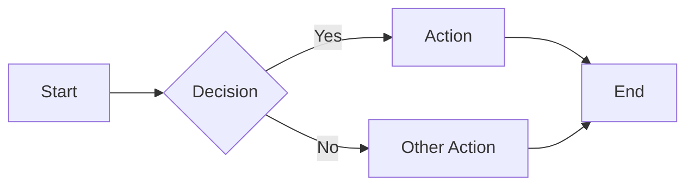
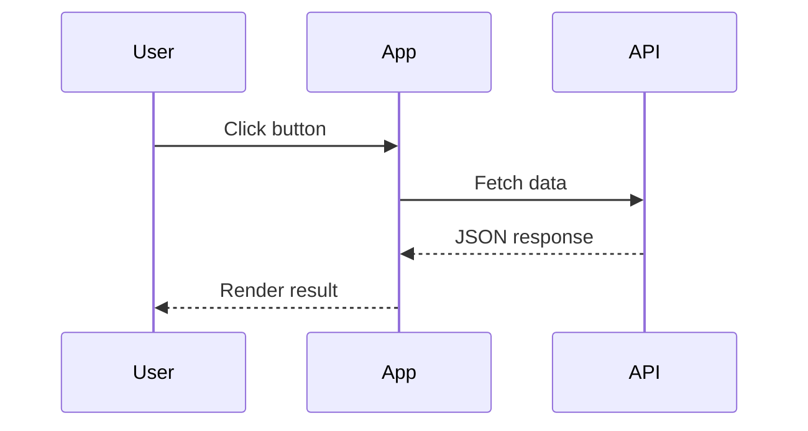
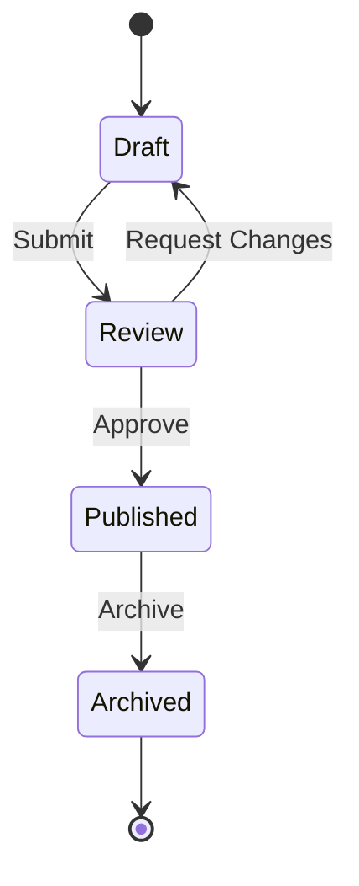

Use fenced code blocks with the `mermaid` language to render diagrams. Mermaid is loaded on-demand — pages without mermaid blocks incur no overhead.

## Flowchart



Source:

````mdx

````

## Sequence Diagram



Source:

````mdx

````

## State Diagram



Source:

````mdx

````

## Configuration

Mermaid support is controlled by the `mermaid` setting in `src/config/settings.ts`:

```ts
export const settings = {
  // ...
  mermaid: true, // enabled by default
};
```

See the [Mermaid documentation](https://mermaid.js.org/) for all supported diagram types.
