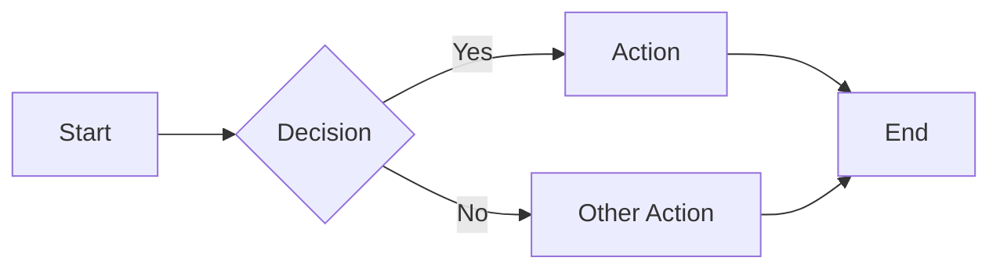
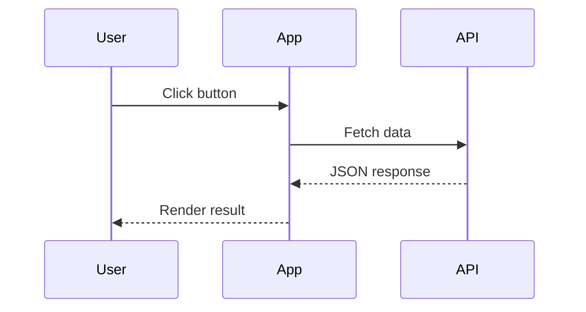
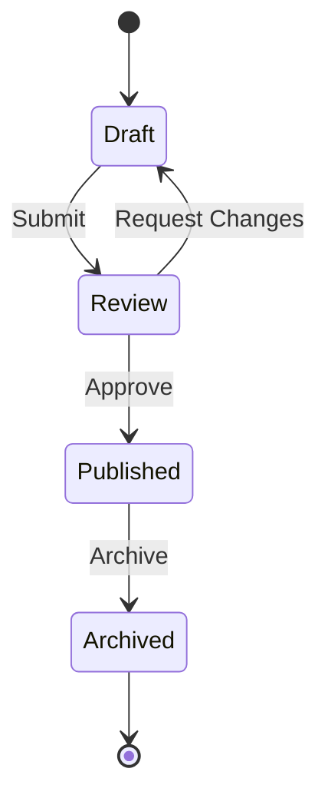
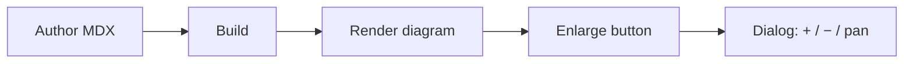

Use fenced code blocks with the `mermaid` language to render diagrams. Mermaid is loaded on-demand — pages without mermaid blocks incur no overhead.

## Flowchart


```mermaid
graph LR
  A[Start] --> B{Decision}
  B -->|Yes| C[Action]
  B -->|No| D[Other Action]
  C --> E[End]
  D --> E
```

````mdx

```mermaid

graph LR
  A[Start] --> B{Decision}
  B -->|Yes| C[Action]
  B -->|No| D[Other Action]
  C --> E[End]
  D --> E

```
````

## Sequence Diagram


```mermaid
sequenceDiagram
  participant User
  participant App
  participant API
  User->>App: Click button
  App->>API: Fetch data
  API-->>App: JSON response
  App-->>User: Render result
```

````mdx

```mermaid

sequenceDiagram
  participant User
  participant App
  participant API
  User->>App: Click button
  App->>API: Fetch data
  API-->>App: JSON response
  App-->>User: Render result

```
````

## State Diagram


```mermaid
stateDiagram-v2
  [*] --> Draft
  Draft --> Review : Submit
  Review --> Published : Approve
  Review --> Draft : Request Changes
  Published --> Archived : Archive
  Archived --> [*]
```

````mdx

```mermaid

stateDiagram-v2
  [*] --> Draft
  Draft --> Review : Submit
  Review --> Published : Approve
  Review --> Draft : Request Changes
  Published --> Archived : Archive
  Archived --> [*]

```
````

## Enlarge & Zoom/Pan

Every rendered diagram shows an **enlarge** button at its top-right corner — the same affordance used by [Image Enlarge](../markdown-features/image-enlarge.mdx). Clicking it opens the diagram in a dialog with Google-Maps-style zoom and pan controls, so dense diagrams can be inspected up close.

The dialog has three controls:

- **`+`** zooms in.
- **`−`** zooms out, but never below the dialog's original full-width size.
- **pan (hand)** lets you drag the diagram around once it's zoomed in.

Their enable/disable behavior:

- On open, the diagram is shown at full size. `−` and **pan** are **disabled** — only `+` is clickable.
- Clicking `+` zooms in and **enables** `−` and **pan**.
- With **pan** active, dragging pans the diagram.
- Clicking `−` zooms out; back at the original full width, `−` and **pan** **disable** again.

Try it on the diagram below — click its enlarge button, zoom with `+`, then pan with the hand:


```mermaid
flowchart LR
  A[Author MDX] --> B[Build]
  B --> C[Render diagram]
  C --> D[Enlarge button]
  D --> E[Dialog: + / − / pan]
```

## Configuration

Mermaid support is controlled by the `mermaid` field in `zfb.config.ts`:

```ts title="zfb.config.ts"
export default defineConfig(
  zudoDoc({
    // ...
    mermaid: true, // enabled by default
  }),
);
```

See the [Mermaid documentation](https://mermaid.js.org/) for all supported diagram types.
