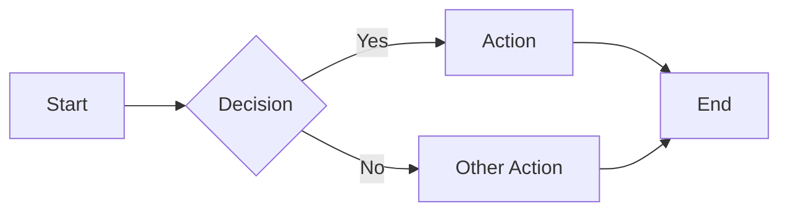
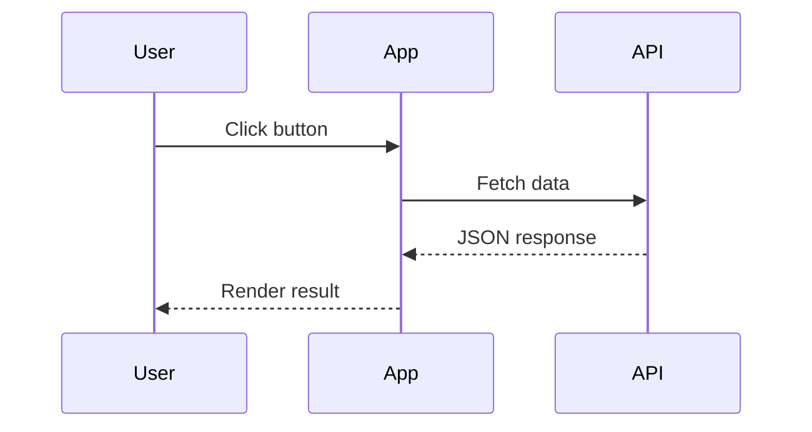
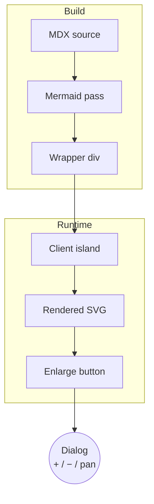

The **Mermaid** feature turns fenced code blocks tagged with the `mermaid` language into rendered diagrams. The build replaces the code block with a wrapper element, and a small client-side island loads the Mermaid library on demand to draw the diagram — pages without a mermaid block incur no overhead.

:::note Opt-in feature

Enable it with the `mermaid` key in `zfb.config.ts`:

```ts
// zfb.config.ts
export default defineConfig({
  markdown: {
    features: {
      mermaid: true,
    },
  },
});
```

:::

## Syntax

Write a fenced code block with `mermaid` as the language identifier:

````md

````

## Live demo

The block below renders as a flowchart on this page:


A sequence diagram works the same way:



## Enlarge & zoom/pan

Every rendered diagram gets an **enlarge** button at its top-right corner, mirroring the [Image Enlarge](./image-enlarge.mdx) affordance. Clicking it opens the diagram in a dialog with Google-Maps-style controls so you can inspect dense diagrams comfortably.

The dialog provides three controls:

- **Zoom in (`+`)** — magnifies the diagram.
- **Zoom out (`−`)** — shrinks the diagram, but never below the dialog's full width.
- **Pan (hand)** — when active, drag the diagram to move it within the dialog.

The controls follow this enable/disable logic:

- On open, the diagram fills the dialog at full size. Only `+` is clickable; `−` and **pan** are **disabled** (you cannot zoom out below the starting size, and there is nothing to pan yet).
- Clicking `+` zooms in and **enables** both `−` and **pan**.
- With **pan** active, dragging moves the diagram around the viewport.
- Clicking `−` zooms back out. Once the diagram returns to its original full-width size, `−` and **pan** **disable** again.

Try it on the flowchart below — click the enlarge button at its top-right, then use `+` to zoom and the hand to pan:



## How it works

At build time the markdown pipeline replaces the `<pre><code class="language-mermaid">` block with a `<div class="mermaid">` wrapper, leaving the diagram source unescaped so the renderer receives the raw Mermaid DSL. The mermaid pass runs before syntax highlighting, so the code highlighter never touches the diagram source. At runtime a client island detects the wrapper and renders the diagram.

See the [Mermaid documentation](https://mermaid.js.org/) for every supported diagram type (flowcharts, sequence, state, class, gantt, and more).

## See also

- [Mermaid Diagrams component](../components/mermaid-diagrams.mdx) — the visual/interaction showcase for the enlarge and zoom/pan dialog
