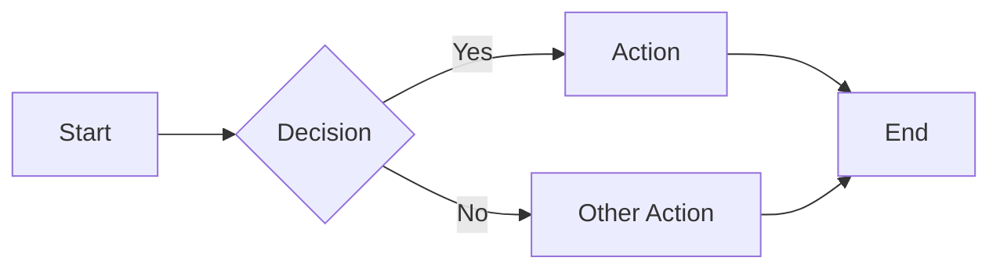
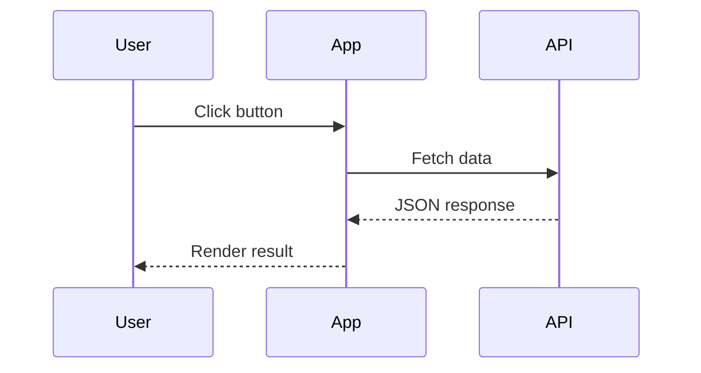

The **Mermaid** feature turns fenced code blocks tagged with the `mermaid` language into rendered diagrams. The build replaces the code block with a wrapper element, and a small client-side island loads the Mermaid library on demand to draw the diagram — pages without a mermaid block incur no overhead.

:::note Opt-in feature

Enable it with the `mermaid` key in `zfb.config.ts`:

```ts
// zfb.config.ts
export default defineConfig({
  markdown: {
    features: {
      mermaid: true,
    },
  },
});
```

:::

## Syntax

Write a fenced code block with `mermaid` as the language identifier:

````md

````

## Live demo

The block below renders as a flowchart on this page:


A sequence diagram works the same way:



## How it works

At build time the markdown pipeline replaces the `<pre><code class="language-mermaid">` block with a `<div class="mermaid">` wrapper, leaving the diagram source unescaped so the renderer receives the raw Mermaid DSL. The mermaid pass runs before syntax highlighting, so syntect never touches the diagram source. At runtime a client island detects the wrapper and renders the diagram.

See the [Mermaid documentation](https://mermaid.js.org/) for every supported diagram type (flowcharts, sequence, state, class, gantt, and more).
