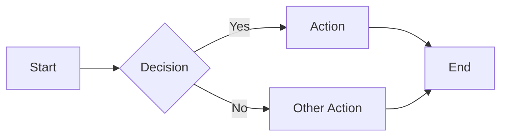
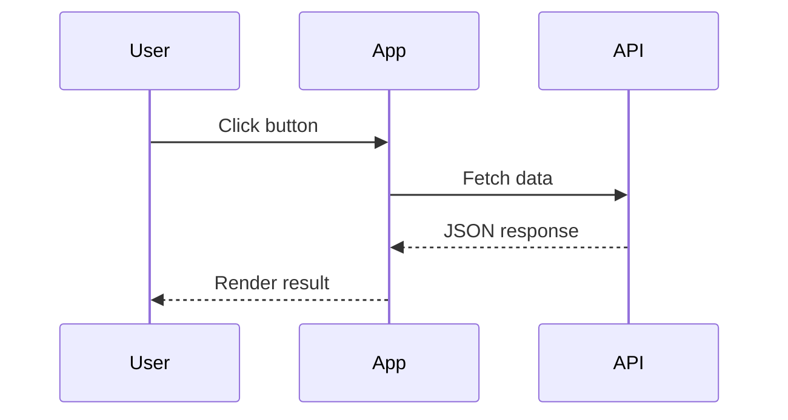
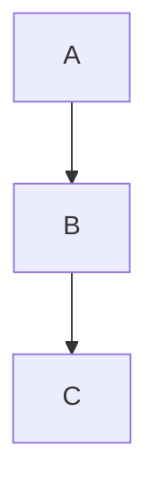

All components listed here are available globally in MDX files — no imports needed.

## Admonitions

Admonitions are callout blocks for highlighting important information. Each type has a distinct color and a default title that can be overridden with the `title` prop.

### Note

<Note>
This is a note admonition — use it for general information.
</Note>

<Note title="Custom Title">
You can provide a custom title using the `title` prop.
</Note>

### Tip

<Tip>
This is a tip — use it for helpful suggestions and best practices.
</Tip>

<Tip title="Pro Tip">
A tip with a custom title.
</Tip>

### Info

<Info>
This is an info block — use it for additional context or background information.
</Info>

<Info title="Did You Know?">
An info block with a custom title.
</Info>

### Warning

<Warning>
This is a warning — use it to flag potential issues or things to watch out for.
</Warning>

<Warning title="Deprecation Notice">
A warning with a custom title.
</Warning>

### Danger

<Danger>
This is a danger alert — use it for critical warnings about data loss or breaking changes.
</Danger>

<Danger title="Breaking Change">
A danger alert with a custom title.
</Danger>

### Admonition Syntax

```mdx
<Note>
Default note with auto-generated title.
</Note>

<Warning title="Be Careful">
Warning with a custom title.
</Warning>
```

### Color Reference

| Type    | Palette Slot | Typical Color |
| ------- | ------------ | ------------- |
| Note    | p4           | Blue          |
| Tip     | p2           | Green         |
| Info    | p6           | Cyan          |
| Warning | p3           | Yellow        |
| Danger  | p1           | Red           |

## Tabs

Use `<Tabs>` and `<TabItem>` to create tabbed content panels. Useful for showing code in multiple languages or platform-specific instructions.

<Tabs>
  <TabItem label="npm" value="npm" default>
    ```bash
    npm install zudo-doc
    ```
  </TabItem>
  <TabItem label="pnpm" value="pnpm">
    ```bash
    pnpm add zudo-doc
    ```
  </TabItem>
  <TabItem label="yarn" value="yarn">
    ```bash
    yarn add zudo-doc
    ```
  </TabItem>
</Tabs>

### Syntax

```mdx
<Tabs>
  <TabItem label="npm" value="npm" default>
    Content for npm tab.
  </TabItem>
  <TabItem label="pnpm" value="pnpm">
    Content for pnpm tab.
  </TabItem>
</Tabs>
```

### Props

**Tabs:**

| Prop | Type | Description |
|------|------|-------------|
| `groupId` | string | Sync tab selection across multiple `<Tabs>` with the same `groupId` (persisted in localStorage) |

**TabItem:**

| Prop | Type | Description |
|------|------|-------------|
| `label` | string | Tab button text (required) |
| `value` | string | Unique value identifier (defaults to `label`) |
| `default` | boolean | Set this tab as the initially active one |

### Synced Tabs

Use `groupId` to sync tab selection across multiple tab groups on the same page:

```mdx
<Tabs groupId="package-manager">
  <TabItem label="npm" default>npm install</TabItem>
  <TabItem label="pnpm">pnpm add</TabItem>
</Tabs>

<!-- This group syncs with the one above -->
<Tabs groupId="package-manager">
  <TabItem label="npm" default>npm run build</TabItem>
  <TabItem label="pnpm">pnpm build</TabItem>
</Tabs>
```

## Details (Collapsible)

Use `<Details>` for collapsible content sections:

<Details title="Click to expand">
This content is hidden by default and revealed when the user clicks the summary.

You can include any MDX content inside, including code blocks and other components.
</Details>

### Syntax

```mdx
<Details title="Optional Title">
Hidden content here.
</Details>
```

| Prop | Type | Default | Description |
|------|------|---------|-------------|
| `title` | string | `"Details"` | The clickable summary text |

## Math Equations

When `math` is enabled in settings (default: `true`), you can render mathematical equations using KaTeX.

### Inline Math

Use single dollar signs for inline math: `$E = mc^2$` renders as $E = mc^2$.

### Block Math

Use double dollar signs for display math:

$$
\int_{-\infty}^{\infty} e^{-x^2} dx = \sqrt{\pi}
$$

### Syntax

```mdx
Inline: $E = mc^2$

Block:
$$
\sum_{i=1}^{n} i = \frac{n(n+1)}{2}
$$
```

You can also use fenced code blocks with the `math` language:

````mdx
```math
\nabla \times \mathbf{E} = -\frac{\partial \mathbf{B}}{\partial t}
```
````

## Mermaid Diagrams

Use fenced code blocks with the `mermaid` language to render diagrams. Mermaid is loaded on-demand — pages without mermaid blocks incur no overhead.

### Flowchart



### Sequence Diagram



### Syntax

````mdx

````

See the [Mermaid documentation](https://mermaid.js.org/) for all supported diagram types.

## Typography

The following standard Markdown/MDX elements are styled through the design token system.

### Headings

Headings from `h2` to `h4` appear in the table of contents on the right sidebar.

### Text Formatting

This is a regular paragraph. You can use **bold text**, _italic text_, and ~~strikethrough text~~. You can also combine **_bold and italic_** together.

### Inline Code

Use backticks for inline code: `const x = 42` or `pnpm dev`.

### Code Blocks

Fenced code blocks use Shiki for syntax highlighting with the active color scheme's theme.

```ts
function greet(name: string): string {
  return `Hello, ${name}!`;
}
```

```css
.container {
  display: flex;
  gap: 1rem;
  align-items: center;
}
```

```mdx
---
title: Example Page
sidebar_position: 1
---

Content goes here with **Markdown** support.
```

### Unordered Lists

- First item
- Second item
  - Nested item A
  - Nested item B
- Third item

### Ordered Lists

1. First step
2. Second step
   1. Sub-step A
   2. Sub-step B
3. Third step

### Blockquotes

> This is a blockquote. It can contain **formatted text** and multiple paragraphs.
>
> Second paragraph in the same blockquote.

### Tables

| Feature        | Status | Notes                    |
| -------------- | ------ | ------------------------ |
| MDX Support    | Active | Enabled by default       |
| Admonitions    | Active | 5 types available        |
| Code Highlight | Active | Shiki with theme support |
| i18n           | Active | English and Japanese     |

### Links

- Internal link: [Writing Docs](/docs/getting-started/writing-docs)
- Internal link: [Introduction](/docs/getting-started/introduction)

### Horizontal Rules

Content above the rule.

---

Content below the rule.
